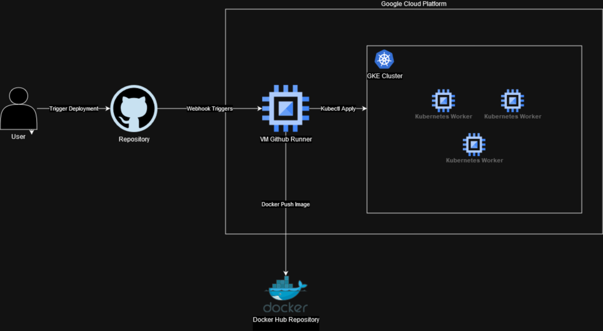

1. Untuk melakukan build image ini menggunakan command:
`docker build -t simple-coding-solitaire:testing/welcome .`
2. Untuk run aplikasi docker yang sudah terbuild dapat menggunakan command:
`docker run -d --name simple-coding -p 8000:5000 simple-coding-solitaire:testing/welcome`
3. Untuk pengerjaan soal diatas saya juga sudah mendeploy aplikasinya ke dalam sebuah VM kubernetes, sesuai dengan instruksi soal. Untuk menaksesnya dapat diakses di https://solitaire.superb.my.id
4. Untuk menampilkan nama bisa dilakukan dengan cara https://solitaire.superb.my.id/welcome/nama
5. Docker Repository: https://hub.docker.com/r/veeryaa/simple-coding-solitaire/tags

High Level Architecture Diagram
